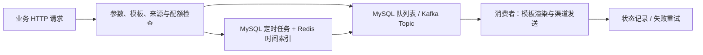

# MsgMate

MsgMate 是个人维护的 Go 异步通知服务，将模板管理、渠道发送、优先级队列、定时任务和入口配额集中在一个独立服务中。业务系统通过 HTTP 提交通知并查询处理结果，可用于学习提醒、任务完成和报告生成等场景。

仓库：[WoAiXueXiHa/MsgMate](https://github.com/WoAiXueXiHa/MsgMate)。业务系统负责事件触发、提醒规则和报告内容，MsgMate 负责处理通知请求。

## 能力与架构

- 六个 HTTP 接口：创建、查询、更新、删除模板，提交通知，查询消息记录。
- 邮件、阿里云短信、飞书渠道适配，模板正文使用 Go `text/template` 渲染。
- MySQL 或 Kafka 异步队列，支持低、中、高三个业务优先级和内部重试队列。
- MySQL 保存定时任务，Redis ZSet 保存时间索引；数据库补扫处理缺失索引的到期任务。
- Redis Lua 实现来源与渠道维度的固定窗口入口限流；记录包含处理状态与失败次数。



MySQL 模式将普通消息记录与入队放在同一事务中。Kafka 模式同步发布并等待 `acks=-1`，消费者在处理成功或转入重试后提交 offset；Kafka 与 MySQL 之间没有跨存储事务。

Redis 用于限流、消费锁、定时索引及可选缓存，关闭缓存仍需 Redis。MySQL 普通队列高、中、低批量大小为 60/30/10；Kafka 各优先级独立消费，不保证跨队列严格顺序。

## 启动

建议使用 Go 1.26 工具链，需要 Docker Compose 和 MySQL 客户端。所有命令在仓库根目录执行。文档统一使用 HTTP 端口 `8081`，实际端口以本地配置为准。

### 首次准备

按 [配置说明](config/README.md) 创建 `config/config-local.toml`，填写数据库、Redis、渠道凭据和 HTTP 端口。已有配置不要覆盖，私有配置不要提交。

```bash
# 启动基础设施；Kafka 宿主端口可通过 MSGMATE_KAFKA_PORT 指定
make docker-run
docker compose ps

# 等待 MySQL 就绪后，仅对尚未建表的新数据库执行
mysql -h 127.0.0.1 -P 3306 -u root -p msgcenter_db < sql/msgcenter.sql

# 启动 Go 服务
make run
```

Compose 提供 MySQL、Redis、Zookeeper 和 Kafka，不包含 Go 服务。数据库及 Redis 密码以本地 Compose 设置为准。MySQL 队列模式不会连接 Kafka，可只启动必要依赖：

```bash
docker compose up -d mysql redis
make run
```

Kafka 模式设置 `mysql_as_mq=false`，配置四个 Topic 和对应消费者组；服务启动时检查 Broker、创建缺失 Topic 并等待 Leader。端口冲突时先调整端口映射与本地连接配置。

### 日常使用

```bash
make run
# 使用其他配置
make run CONFIG=/absolute/path/to/config.toml
# 编译后运行
make msgsvr
./bin/msgmate -config config/config-local.toml
```

前台运行用 `Ctrl+C` 停止服务，再按需执行 `make docker-stop` 停止基础设施。数据目录位于 `docker-compose/`，不要删除现有数据。日志位于 `log/`。同一数据库只运行一个服务实例。

## 接入与项目规则

完整参数、curl 和 Go 示例见 [API.md](API.md)，机器可读定义见 [openapi.yml](openapi.yml)。接入流程为创建模板 → 管理员启用模板 → 提交通知 → 保存 `msgID` → 查询记录。

- `Source-Id` 标识业务来源，发送时必须与模板 `sourceID` 一致，记录查询检查记录来源。该字段不是身份认证；模板管理接口没有来源访问隔离，仅面向可信调用方。
- 模板创建后状态为待审核 `1`，管理员在数据库设为启用 `2` 后才能发送。更新和删除会清理模板缓存，修改模板可能影响尚未处理的消息，删除前应确认没有在途依赖。
- 业务优先级为低 `1`、中 `2`、高 `3`，省略或 `0` 默认为低；`4` 仅供内部重试。
- 所有业务 Handler 返回 HTTP 200，调用方必须检查 JSON `code`。`code=0` 只表示接口操作成功。
- 消息状态为待处理 `1`、渠道接受 `2`、最终失败 `3`；`retryCount` 是失败次数，达到配置阈值后停止重试。渠道接受不代表用户已收到。
- 配额按来源和渠道计数，业务配额覆盖渠道全局默认配置。它限制提交入口，不限制到期任务和重试的实际渠道调用速率。
- 服务面向单实例：启动恢复处理中任务。没有提交幂等、Outbox、死信存储或严格一次投递保证；渠道接受后进程崩溃仍可能重复发送。
- 客户端超时可能发生在请求已提交之后，不应盲目重复提交。业务事件和通知提交之间没有跨服务事务。
- 定时功能接收 Unix 秒时间戳，不提供周期规则、取消或修改定时任务接口，也不保证准时送达。

## 测试

```bash
# 单元测试、race 和 vet；不发送真实通知
make test
# 隔离集成测试：配置必须指向已建表且名称以 _test 结尾的数据库
make integration CONFIG=/absolute/path/to/integration-config.toml
```

集成测试使用真实 MySQL、Redis、Kafka 与可控渠道处理器，检查接口、队列、定时、重试、状态与限流；缺少依赖会失败。真实发送需显式提供接收人运行 `scripts/acceptance.go`，不得用真实渠道执行故障重试测试，也不要删除发送 ledger 后重复提交。

## 联系与 Issues

问题、使用讨论和功能建议请通过 [GitHub Issues](https://github.com/WoAiXueXiHa/MsgMate/issues) 联系维护者。提交问题时请提供：

- 版本或提交号、Go 版本、操作系统与队列模式。
- 脱敏后的相关配置和最小复现步骤。
- 预期结果、实际结果、业务错误码和相关日志。

不要公开密码、授权码、手机号、邮箱收件人或完整通知正文。请先搜索已有 Issue；功能建议说明使用场景、预期行为和必要性。

## 贡献

欢迎通过 Issue 和 Pull Request 交流、学习与贡献。PR 请说明解决的问题、行为变化和验证结果，保持改动集中，提交前运行 `make test`，涉及队列或数据库链路时运行隔离集成测试。
