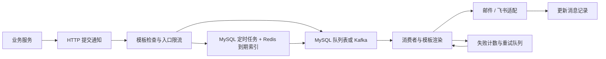

# MsgMate：通用异步通知服务

MsgMate 是个人维护的 Go 后端造轮子项目。面向学习提醒、任务完成、报告生成等各种通知需求，将模板处理、渠道调用和异步消费集中到独立服务，探索一套后续可供 LearnQ 和其他个人项目复用的通知组件。当前尚未与这些业务完成集成。

## 当前能力

- **渠道抽象**：通过 Go 接口和 Handler 注册机制适配邮件、飞书；源码也保留短信适配，但不作为个人接入主线。
- **异步投递**：通过配置选择 MySQL 队列表或 Kafka 中转。
- **优先级队列**：划分高、中、低和重试队列；Kafka 消费并发为 6/3/1/1，MySQL 按优先级差异化批量拉取。提供资源倾斜，不保证跨队列严格优先顺序。
- **失败重试**：记录失败计数、使用独立重试队列，达到阈值后标记失败；MySQL 重试表通过唯一索引避免重复插入同一记录。
- **定时发送**：MySQL 保存任务，Redis ZSet 保存到期时间项，Lua 原子取出并删除到期项，Redis 分布式锁协调调度。
- **入口限流**：按业务来源和渠道进行固定窗口计数，业务配额覆盖全局默认配额。

技术栈：Go / Gin / GORM / MySQL / Redis / Kafka / SMTP / 飞书 API。

## 请求链路



## 本地启动

需要 Go（实际最低工具链以依赖要求为准）、Docker Compose 和 MySQL 客户端。以下命令从仓库根目录执行，仅适用于新的本地数据库：

```bash
docker compose up -d mysql redis zookeeper kafka
# 等待 MySQL 就绪后导入表结构与默认渠道配额；已有表不要重复导入。
mysql -h 127.0.0.1 -P 3306 -u root -p msgcenter_db < sql/msgcenter.sql
# 先准备本地配置，填写数据库、Redis、Kafka 和邮箱信息。
go run ./src -config /absolute/path/to/config-local.toml
```

配置字段及占位示例见 [配置说明](config/README.md)。Compose 仅启动基础设施，不包含 Go 服务；监听端口来自 `[common].port`。

即使选择 MySQL Queue，初始化仍会根据 Kafka 配置创建生产者和消费者对象，不能宣称完全移除了 Kafka 初始化依赖。Redis 始终用于限流和分布式锁，`open_cache=false` 只关闭业务缓存。程序初始化会输出配置，运行日志须按私有信息保管。

邮件当前固定使用 QQ SMTP；飞书应用凭据通过环境变量 `FEISHU_APP_ID` 和 `FEISHU_APP_SECRET` 设置。真实发送仍需填写自己的凭据并验证。

## 最短接入流程

业务通过 HTTP 调用，无需导入本仓库的 Go 包。先创建并启用模板，再提交接收人与模板参数。以下示例按源码整理，未做真实发送验证。

```bash
curl -X POST http://localhost:8081/msg/create_template \
  -H 'Content-Type: application/json' -H 'Source-Id: learnq' \
  -d '{"sourceID":"learnq","name":"learning-reminder-email","subject":"学习提醒","channel":1,"content":"{{.name}}，请复习：{{.title}}"}'
```

从成功响应获取 `templateID`。模板默认待审核，需要在本地数据库启用（没有审核 API）：

```sql
UPDATE t_msg_template SET status = 2 WHERE template_id = '<templateID>';
```

```bash
curl -X POST http://localhost:8081/msg/send_msg \
  -H 'Content-Type: application/json' -H 'Source-Id: learnq' \
  -d '{"to":"recipient@example.com","templateID":"<templateID>","priority":2,"templateData":{"name":"同学","title":"Go Channel"}}'
```

检查响应 `code` 为 `0` 并保存 `msgID`。HTTP 200 本身不代表成功；提交成功也不代表渠道成功或用户已收到。完整的六个接口、SQL 准备、定时示例及 Go 调用代码见 [API 接入文档](docs/API.md)；机器可读定义见 [OpenAPI](openapi.yml)。

## 后续场景接入

| 场景 | 业务触发点 | 模板参数示例 |
|---|---|---|
| LearnQ 学习提醒 | 业务生成提醒计划后提交定时消息 | `name`、`title` |
| 任务完成通知 | 业务任务完成并落库后提交即时消息 | `taskName`、`result` |
| 报告生成通知 | 报告生成成功后提交即时消息 | `reportName`、`url` |

每个场景、每个渠道创建独立模板；业务保存模板 ID，事件发生时传入参数和接收人。不同项目用不同 `Source-Id` 标识，并准备对应配额。MsgMate 不检测业务任务是否完成、不生成报告，也不提供周期性提醒规则；这些由业务服务负责。

## 实现边界

- `Source-Id` 是业务标识，不是认证；接口未提供可靠的业务身份认证和访问隔离，当前不适合直接暴露公网。
- 当前消息查询 API 只返回记录内容，没有返回投递状态、失败计数；内部状态常量存在不一致，不能据此承诺完整状态机。
- 创建/更新消息记录与队列写入、渠道发送不是同一事务；没有提交幂等及外部发送幂等保证。
- Kafka 重试发布错误被忽略，且生产者初始化强制启用异步发送；不能将接口成功解释为 Kafka 持久化确认或保证必达。
- 定时任务缺少完整的跨存储补偿、索引重建及处理中任务恢复。ZSet 保存时间项，任务本体来自 MySQL。
- 限流在提交入口进行，重试及定时任务实际发送时不经过同一限制；不是下游发送频控。
- 飞书发送方法目前未检查响应业务错误码，代码返回成功不等于飞书接受了消息。

本文说明代码现状，不宣称真实渠道验收、压测性能、生产 SLA 或生产可用。
